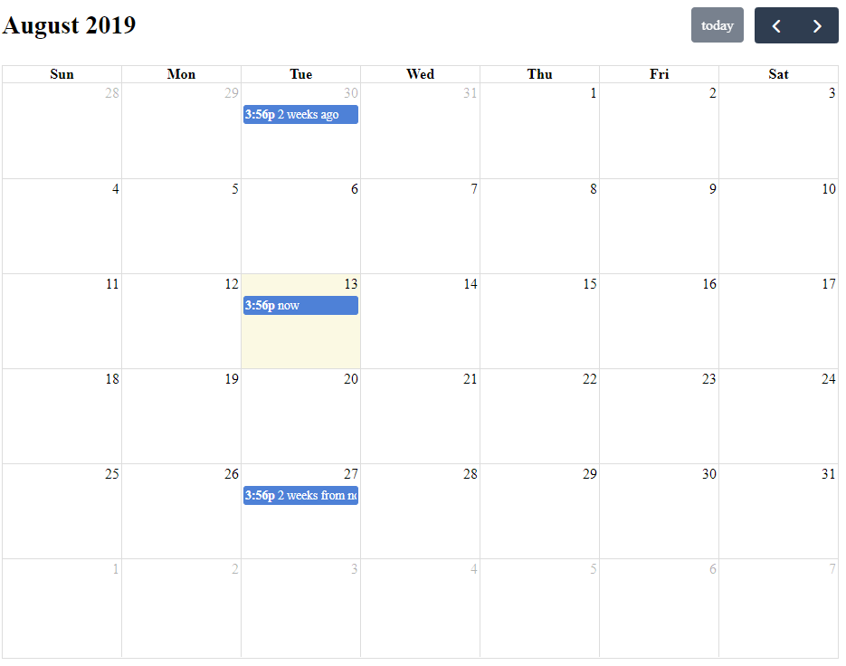
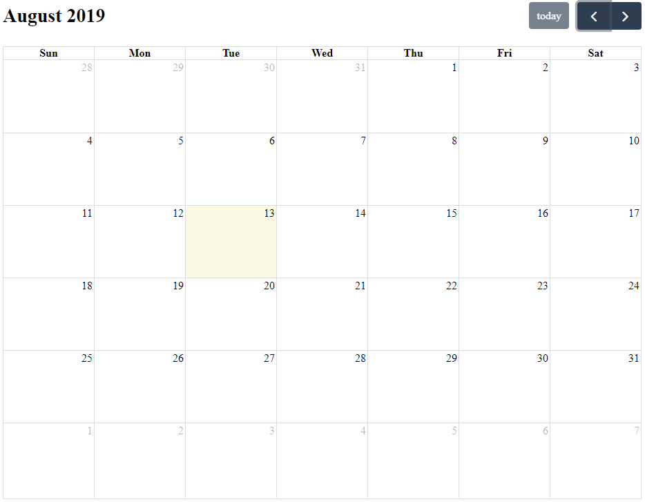

### Issue

I am using version 4.3.0 with a month view. I have one asynchronous data source. When I navigate away from a month and quickly back to it (before next month's events return from server), some or all events from this month disappear. It only causes a problem when your data source is slow enough.

Screenshots:

| Before Nav / Expected | After Quick Nav (Bug) |
| --- | --- |
|  |  |

I know this is very similar to #3920, but that issue was closed and my set-up is different than his. (sorry, if it is).

### Reproduction

I have a reproduction here: [FullCalendar Bug #3920 Demonstration](https://doublemx2-fullcalendar-bug3920.herokuapp.com/). It's a Heroku app because I needed a custom server. Here's the repo, in case you want to see the set-up: [doublemix/fullcalendar-bug-3920](https://github.com/doublemix/fullcalendar-bug-3920)

### Suspected Cause

I believe the cause is in [`core/reducers/eventSources`](https://github.com/fullcalendar/fullcalendar/blob/0141b3d496f63d789424cd6d25e2776b370ed117/packages/core/src/reducers/eventSources.ts#L76-L98)

When you navigate back to a month before the next month has finished loading, `fetchDirtySources` and `isSourceDirty` don't find any dirty sources (since this month's data is still there), and therefore `latestFetchId` is not updated. Then, when the response comes back, since the `latestFetchId` is still the same, the calendar replaces this month's events with next month's (in [`receiveResponse`](https://github.com/fullcalendar/fullcalendar/blob/0141b3d496f63d789424cd6d25e2776b370ed117/packages/core/src/reducers/eventSources.ts#L186-L191)), making it appear as though they are disappearing.

### Workaround

I found that disabling lazy fetching fixes the problem because then the sources are always dirty.
